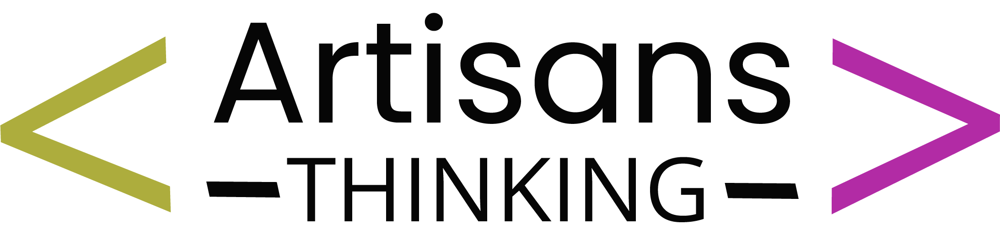

# 🏢 Estudio Jurídico NZ

<div align="center">
  
  
  
  
  
</div>

## 📋 Descripción
Sitio web profesional para el Estudio Jurídico de la Dra. Nadina Zaranich, desarrollado por [Artisans Thinking](https://artisanthinking.com). Plataforma diseñada para ofrecer una experiencia de usuario óptima y facilitar la gestión de propiedades inmobiliarias.

## ✨ Características Principales

### 🌐 Páginas y Secciones
- **Inicio**: Presentación del estudio y servicios destacados
- **Servicios**: Listado detallado de áreas de práctica
- **Equipo**: Perfiles profesionales del equipo
- **Contacto**: Formulario de contacto y ubicación con Google Maps
- **Login**: Sistema de autenticación para administradores
- **Gestión de Propiedades**: Panel completo para administrar propiedades inmobiliarias
- **Ordenamiento Personalizado**: Interfaz de arrastrar y soltar para ordenar propiedades por categoría

### 📱 Diseño Responsivo
- Adaptable a todos los dispositivos (móviles, tablets, escritorio)
- Navegación intuitiva
- Tiempos de carga optimizados

### 🛠️ Stack Tecnológico

#### Frontend
- **HTML5** - Estructura semántica
- **CSS3** - Estilos personalizados
- **Bootstrap 5** - Framework CSS
- **JavaScript** - Interactividad
- **Bootstrap Icons** - Iconografía

#### Backend
- **PHP 8.2.12** - Procesamiento del lado del servidor
- **MySQL 10.4.32** - Base de datos relacional
- **XAMPP** - Entorno de desarrollo local

## 🚀 Instalación

1. **Requisitos Previos**
   - XAMPP (o servidor web con soporte PHP)
   - Navegador web actualizado
   - Git

2. **Configuración**
   ```bash
   # Clonar el repositorio
   git clone [URL_DEL_REPOSITORIO]
   
   # Importar la base de datos
   mysql -u root -p nz-estudio < nz-estudio.sql
   
   # Configurar el archivo de conexión
   # Editar config/config.php con tus credenciales
   ```

3. **Iniciar el Servidor**
   - Iniciar Apache y MySQL desde el panel de control de XAMPP
   - Abrir el navegador y navegar a: `http://localhost/nz-estudio`

## 🎨 Estructura del Proyecto

```
nz-estudio/
├── assets/
│   ├── css/           # Hojas de estilo
│   ├── js/            # Archivos JavaScript
│   └── img/           # Imágenes y recursos gráficos
├── config/            # Archivos de configuración
├── includes/          # Archivos PHP reutilizables
├── templates/         # Plantillas de páginas
├── admin/            # Panel de administración
├── uploads/          # Archivos subidos
├── propiedades/      # Páginas de propiedades
└── .htaccess         # Configuración de Apache
```

## 🔐 Sistema de Autenticación

El sitio incluye un sistema de autenticación seguro para el panel de administración.

### Características:
- Validación de formularios en el cliente y el servidor
- Protección contra ataques de inyección SQL
- Manejo de sesiones seguras
- Interfaz de usuario intuitiva con mensajes de retroalimentación

## 📱 Diseño Responsive

- **Mobile First**: Diseño pensado primero para móviles
- **Breakpoints**:
  - Móvil: < 768px
  - Tablet: 768px - 991px
  - Escritorio: ≥ 992px
- **Imágenes adaptativas**: Uso de `srcset` para diferentes resoluciones

## 🔒 Seguridad

- **Protección contra inyección SQL**: Uso de consultas preparadas PDO
- **Validación de entrada**: Filtrado de datos de usuario
- **Protección XSS**: Escapado de salida
- **Seguridad de sesiones**: Configuración segura de cookies
- **Headers de seguridad**: Configurados en `.htaccess`

## 📈 Optimización

- **Caché**: Headers de caché apropiados
- **Minificación**: CSS y JS minificados en producción
- **Optimización de imágenes**: Compresión automática
- **Lazy loading**: Para imágenes fuera del viewport

## 📊 SEO

- **URLs amigables**: Estructura clara y legible
- **Meta etiquetas**: Títulos y descripciones únicas
- **Datos estructurados**: Schema.org para propiedades inmobiliarias
- **Sitemap.xml**: Generación automática
- **robots.txt**: Configuración para motores de búsqueda

## 📞 Contacto

- **Estudio Jurídico NZ**  
  📍 Catamarca 227, Guatimozín, Córdoba  
  📧 nadinazaranich@gmail.com  
  📱 3468 52-5227

## 🤝 Contribuciones

Las contribuciones son bienvenidas. Por favor, lee las [pautas de contribución](CONTRIBUTING.md) antes de enviar un pull request.

## 📄 Licencia

Este proyecto está bajo la Licencia MIT. Consulta el archivo [LICENSE](LICENSE) para más información.

---
<div align="center">
  <p>Desarrollado con ❤️ por <a href="https://artisanthinking.com">Artisans Thinking</a></p>
  
</div>
